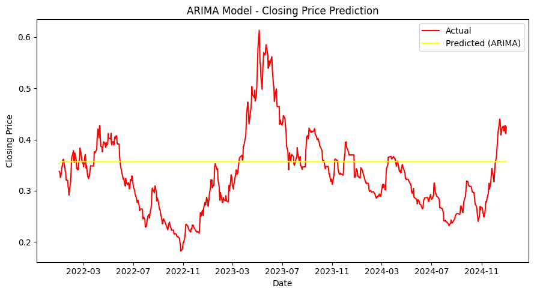
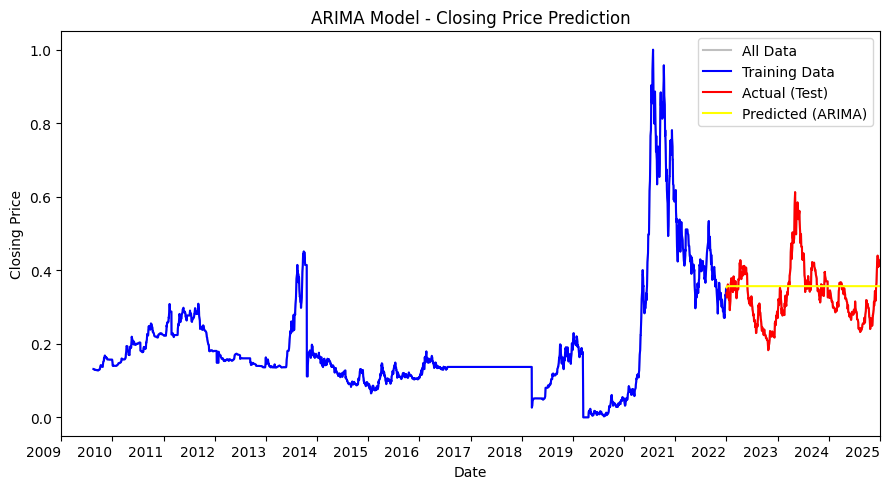
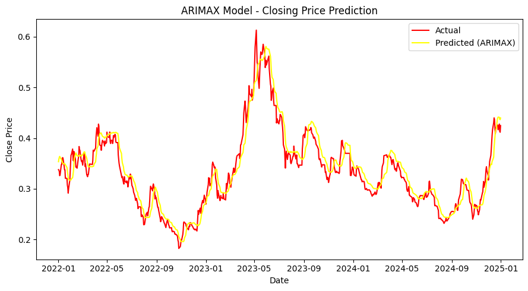
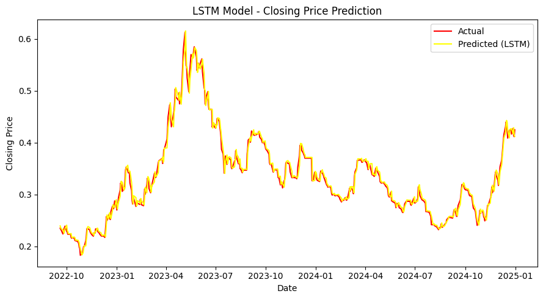
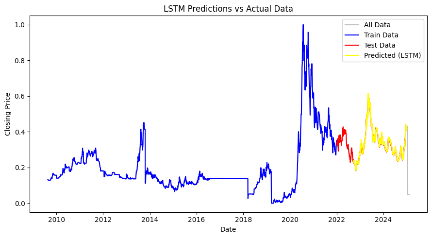
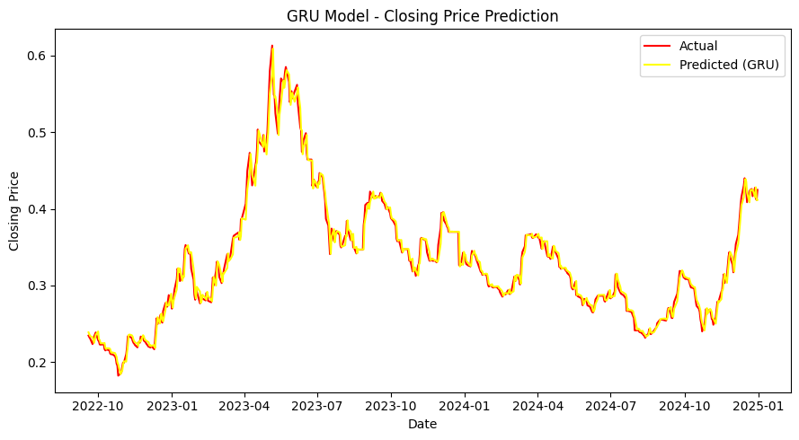
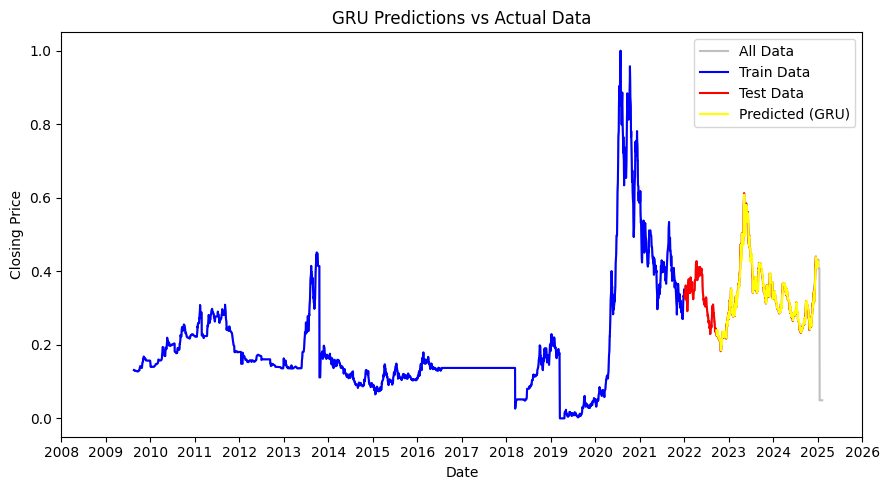

# Stock Price Forecasting

Stock price forecasting using classical ARIMA, ARIMAX models and deep learning models LSTM and GRU
This Project predict the price of Saderat Bank one day ahead for three years
using four models. These include two classic models,ARIMA and ARIMAX which incorporate exogenous variables:
1.  The 10 day moving average of the closing price(trend indicator)
2.  The standard deviation of the closing price over 10 years(volatility measure)
3.  Trading volume
Additionally, two deep learning models, LSTM and GRU are used for enhanced prediction accuracy.

## Installation
### 🔹1.Run the project in Google Colab(Recommended)
click to open project directly in **Google Colab**:
[](https://colab.research.google.com/github/Jbitaj/Stock_Price_Forecasting/blob/AALG/Stock_Price_Forecasting.ipynb)
### 🔹2. Run the project locally (personal computer)
1. Fisrt install **Python 3.11+**
2. Then clone the repository:
```bash
git clone
cd Stock_Price_Forecasting
```
3.install the required libraries.
```bash
pip install -r requirements.txt
```
4.Run `jupyter notebook`
## Documetation
**ARIMA** & **ARIMAX** Classical Models
if the data is not stationary,it must be differentiated using the ADF Test.
**LSTM** & **GRU** Deep Learning Models
Only based on exprience and randomness can you change the required parameters to achieve the desired results.
**MSE** & **MAE** & **Rsquared** have been used to evaluate the models.

## Model Performance and Outputs
in this section you will see the graphs and results of the models.This includes:

-📈 **ARIMA model forecast graphs:**



-📈 **ARIMAX model forecast graphs:**




-📈 **LSTM model forecast graphs:**




-📈 **GRU model forecast graphs:**





